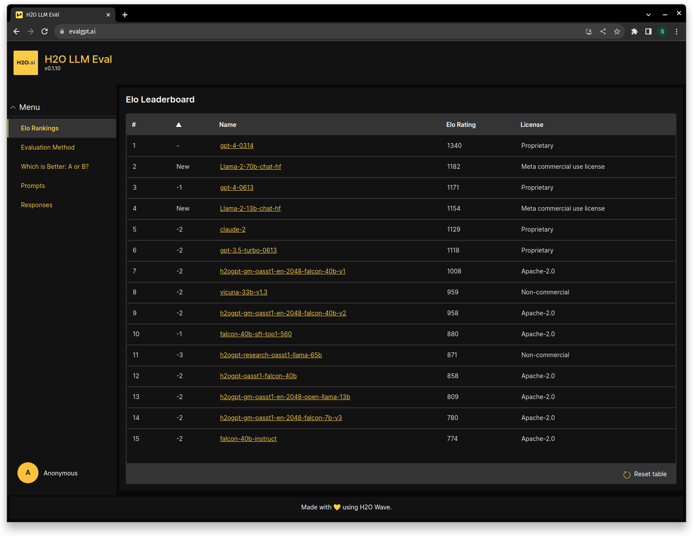
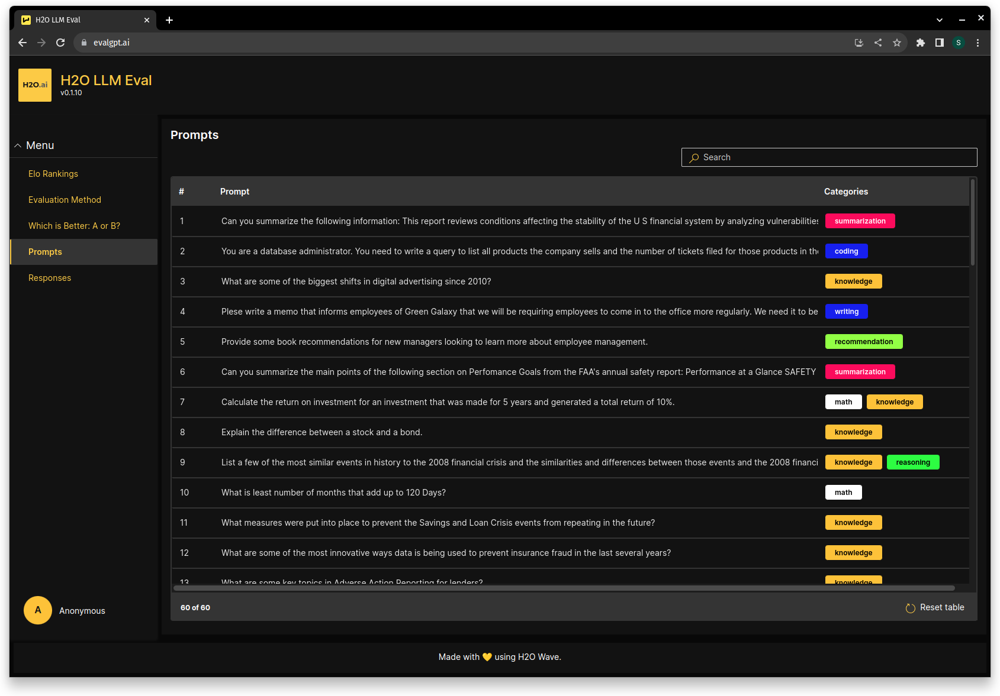
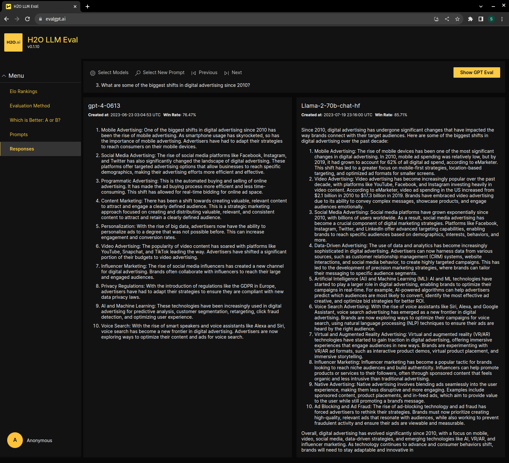
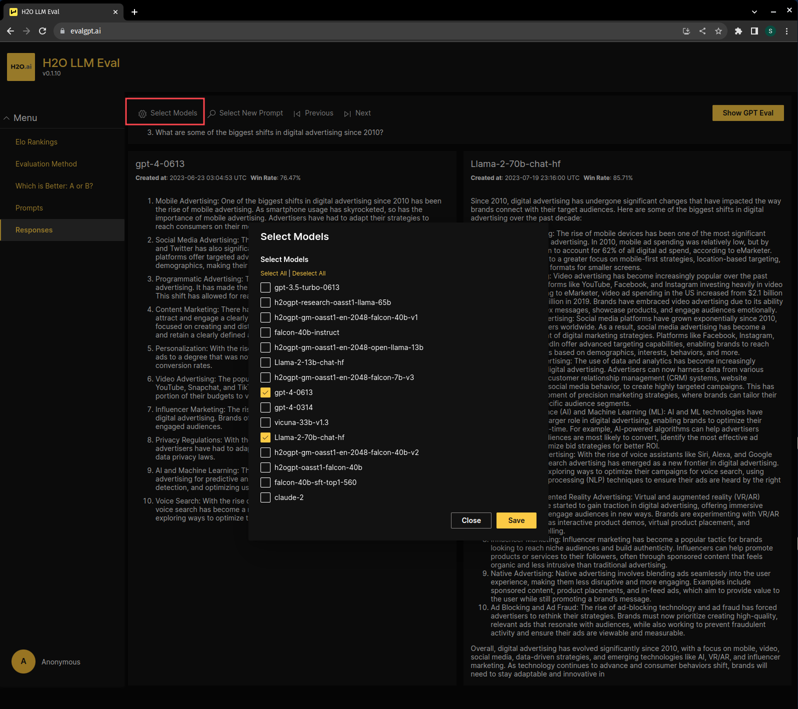
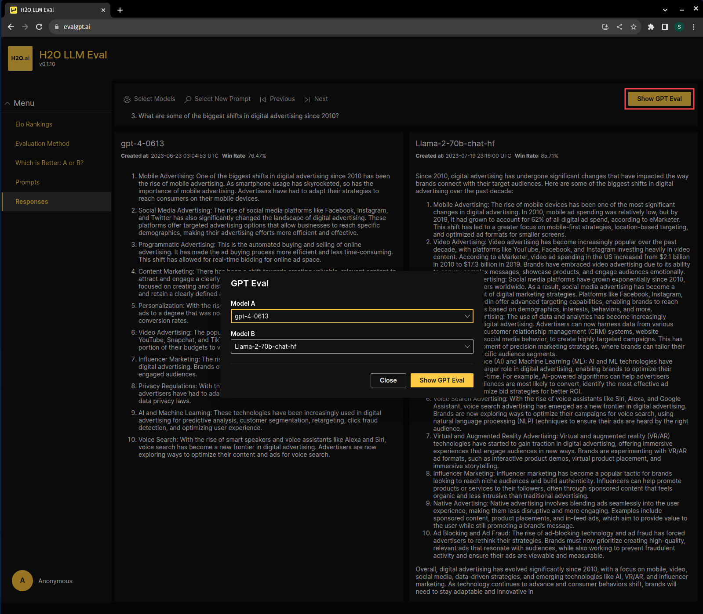
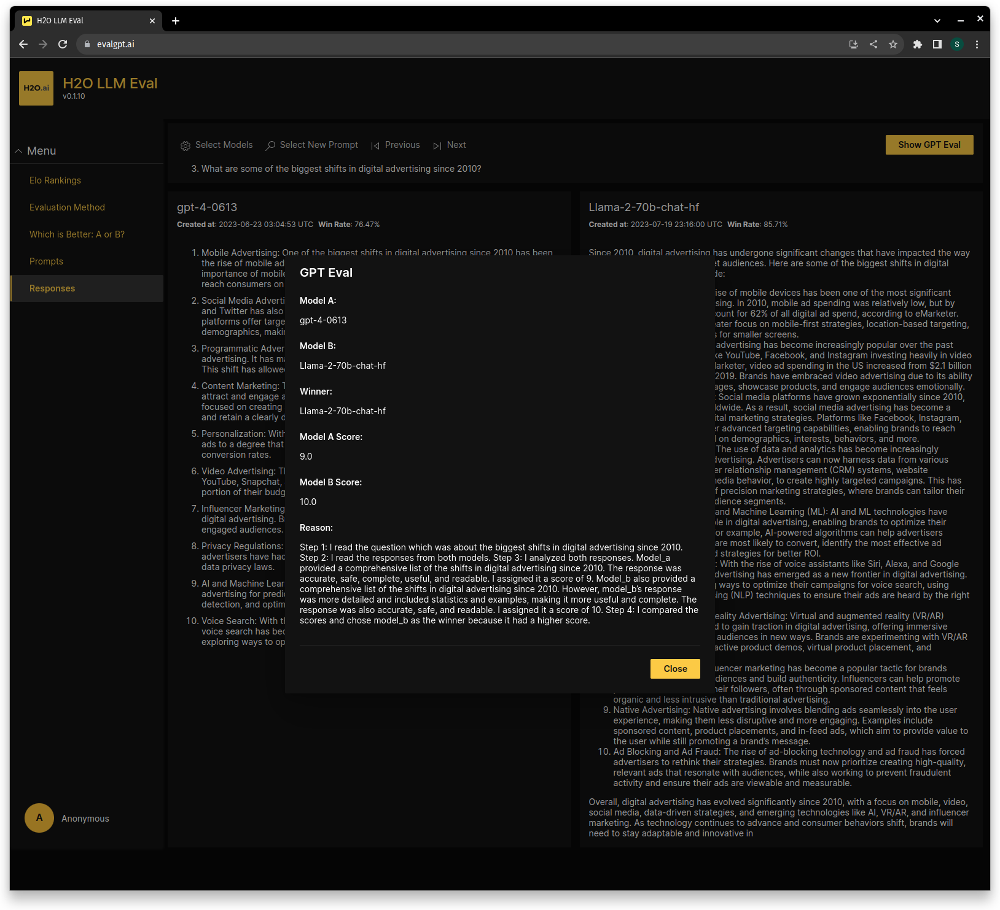
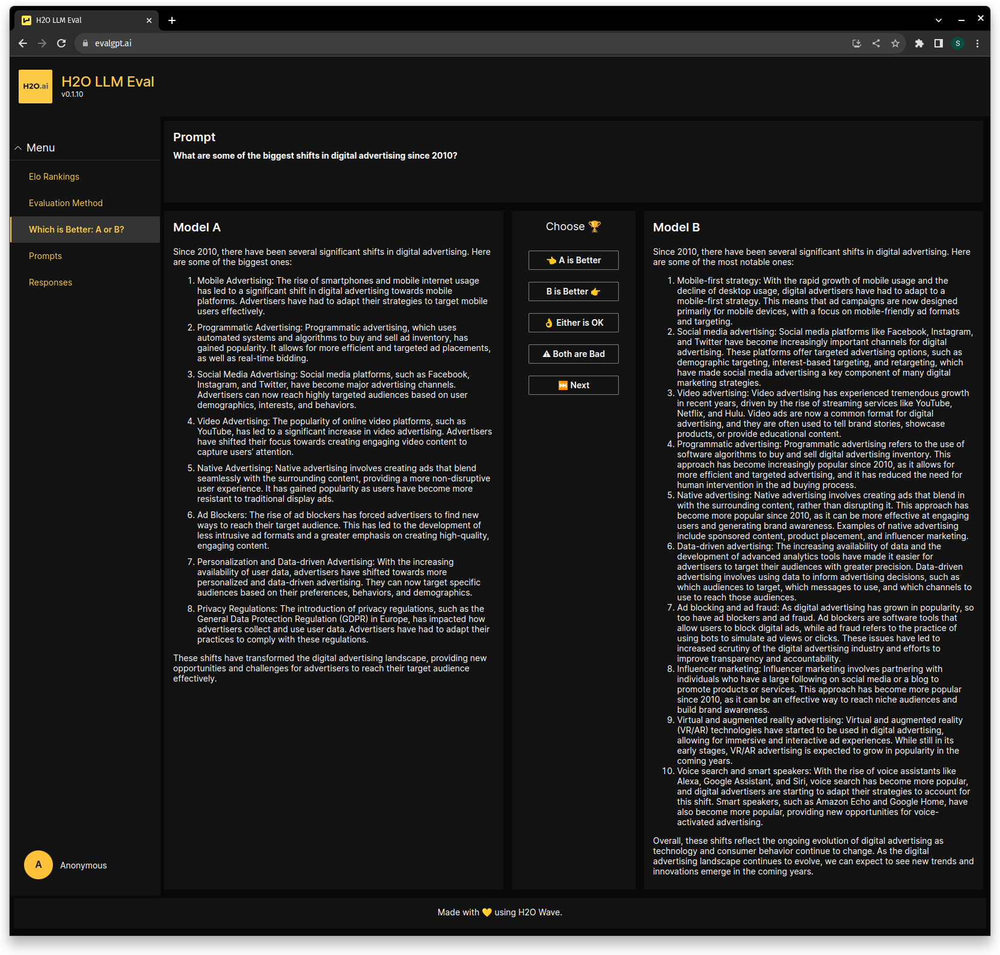

# H2O Large Language Model (LLM) Evaluation

In an era where Large Language Models (LLMs) are rapidly gaining traction for diverse applications, the need for comprehensive evaluation and comparison of these models has never been more critical.
This repository is an effort in that direction, providing an evaluation method and the toolkit for the assessment of Large Language Models.

Please read the [Blog Post](https://h2o.ai/blog/h2o-llm-evalgpt-a-comprehensive-tool-for-evaluating-large-language-models/) for more context.

- [EvalGPT.ai](#evalgptai)
    - [Elo Leaderboard](#elo-leaderboard)
    - [Prompts](#prompts)
    - [Responses](#responses)
    - [A/B Tests](#ab-tests)
- [Local Setup](#local-setup)
- [Reproducing Leaderboard](#reproducing-leaderboard-results)


## EvalGPT.ai

[evalgpt.ai](https://evalgpt.ai/) hosts the Leaderboard of some of the top LLMs ranked by their Elo scores. The leaderboard is updated frequently and provides a comprehensive and fair assessment of Large Language Models. Different features of the website are described below.

### Elo Leaderboard

The Elo Leaderboard provides a ranking of the top LLMs based on their Elo scores. The Elo scores are computed from the results of A/B tests, wherein the LLMs are pitted against each other in a series of games. The ranking system employed is based on the [Elo Rating System](https://en.wikipedia.org/wiki/Elo_rating_system). The procedure for Elo score computation closely follows the methodology outlined at [this resource](https://lmsys.org/blog/2023-05-25-leaderboard/).



### Prompts

Prompts tab has the list of 60 prompts used to evaluate the LLMs. The prompts are categorized into different categories based on the type of task they are designed for.



### Responses

In the Responses section, you can see the responses generated by the LLMs for the prompts. You can also select the LLMs and prompts to compare the responses.



Click on the "Select Models" button to select the LLMs to compare. You can also select a different prompt using the "Previous" and "Next" buttons.



For any two selected models and the prompt, you can see the evaluation by GPT4 by clicking on the "Show GPT Eval" button on the top right.





### A/B Tests

"Which is Better: A or B?" provides the interface to perform human evaluation of the LLMs. Each A/B test consists of a prompt and two responses generated by two different LLMs. The user is asked to select the better response among the two.



## Local Setup

1. Clone the repository

```bash
git clone https://github.com/h2oai/h2o-LLM-eval.git
```

2. Setup Database

- Create a docker volume for the database

```bash
docker volume create llm-eval-pg14-data
```

- Start PostgreSQL 14 in docker

```bash
docker run -d --name=llm-eval-pg14 -p 5432:5432 -v llm-eval-pg14-data:/var/lib/postgresql/data -e POSTGRES_PASSWORD=easypassword postgres:14.8-bullseye
```

- Install PostgreSQL client

On Ubuntu:

```bash
sudo apt update
sudo apt install postgresql-client
```

On macOS:

```bash
brew install libpq
echo 'export PATH="/usr/local/opt/libpq/bin:$PATH"' >> ~/.zshrc
```

- Connect to Postgres and create a new user "maker". Use the password "easypassword" from the previous command when prompted

```bash
psql --host=localhost --port=5432 --username=postgres --password -c "CREATE ROLE maker WITH CREATEDB LOGIN PASSWORD 'makerpassword';"
```

- Login as new user and create a database. User the password "makerpassword" from the previous command when prompted

```bash
psql --host=localhost --port=5432 --username=maker --password --dbname=postgres -c "CREATE DATABASE llm_eval_db;"
```

- Check that the database is created

```bash
psql --host=localhost --port=5432 --username=maker --password --dbname=llm_eval_db -c "SELECT 1;"
```

- Load the latest data dump into the database

```bash
gunzip -c data/llm_eval_db_dump_2023-07-26_18-54-50.sql.gz |  psql --host=localhost --port=5432 --username=maker --password --dbname=llm_eval_db
```


3. Setup the environment:

The setup is tested on Python 3.10

```bash
python -m venv .venv
```

```bash
. .venv/bin/activate
```

```bash
pip install --upgrade pip
pip install -r requirements.txt
```

4. Run the App

- Rename .env.example to .env

```bash
mv .env.example .env
```

- Load the environment variables

```bash
source .env
```

- Start the wave app

```bash
wave run llm_eval/app.py
```

- Navigate to http://localhost:10101/ in your browser


## Reproducing Leaderboard Results

We provide [notebooks](notebooks) to generate leaderboard results and reproduce [evalgpt.ai](https://evalgpt.ai).
1. Run [run_all_evaluations.ipynb](notebooks/run_all_evaluations.ipynb) to evaluate any A/B tests that have not yet been evaluated by a chosen evaluation model and insert the outcomes into the database. An A/B test is considered unevaluated by the given model if no evaluation by the model exists for the given combination of models and prompt. After adding a model, running this evaluates all A/B tests for the model against all other models.
2. Run all cells in [calculate_elo_rating_public_leaderboard.ipynb](notebooks/calculate_elo_rating_public_leaderboard.ipynb) to get the Elo leaderboard and relevant charts given the evaluations in the database.

